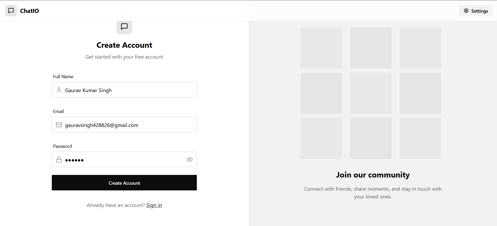
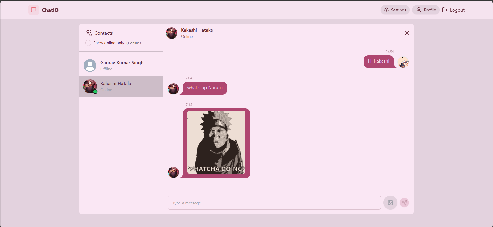
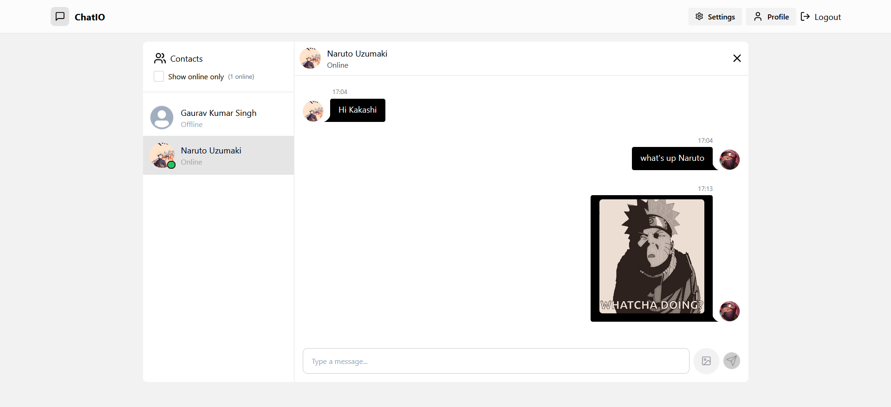

# ChatIO

ChatIO is a modern real-time chat application built with React, Node.js, Express, MongoDB, and Socket.IO. It features user authentication, profile management, image uploads, and a beautiful, themeable UI powered by Tailwind CSS and DaisyUI.

## Features

- Real-time messaging with Socket.IO
- User authentication (Sign up, Login, Logout)
- Profile management with avatar upload
- Theme selection (30+ DaisyUI themes)
- Responsive and modern UI
- Image sharing in chat
- Online users indicator

## Screenshots

### Sign Up




### Chat UI





## Getting Started

### Prerequisites

- Node.js (v18+ recommended)
- MongoDB database
- Cloudinary account (for image uploads)

### Installation

1. **Clone the repository:**
   ```sh
   git clone https://github.com/yourusername/chatio.git
   cd chatio
   ```

2. **Install dependencies for both client and server:**
   ```sh
   npm install
   cd server
   npm install
   cd ..
   ```

3. **Set up environment variables:**

   Copy `.env.example` to `.env` in the `server` directory and fill in your credentials:
   ```sh
   cp server/.env.example server/.env
   ```

4. **Run the development servers:**

   - **Client:**
     ```sh
     npm run dev
     ```
   - **Server:**
     ```sh
     cd server
     npm run dev
     ```

5. **Open your browser:**
   - Visit [http://localhost:5173](http://localhost:5173)

## Folder Structure

```
├── public/
│   ├── avatar.png
│   ├── signup.png
│   ├── user1.png
│   ├── user2.png
│   └── vite.svg
├── src/
│   ├── components/
│   ├── constants/
│   ├── lib/
│   ├── pages/
│   └── store/
└── server/
    ├── src/
    ├── .env
    └── ...
```

## Technologies Used

- React
- Zustand (state management)
- Tailwind CSS & DaisyUI
- Express.js
- MongoDB & Mongoose
- Socket.IO
- Cloudinary (image uploads)

## License

MIT

## Author

[Gaurav Kumar Singh](https://github.com/gaurav4288)

---

**Made with ❤️ for learning and chatting!**
